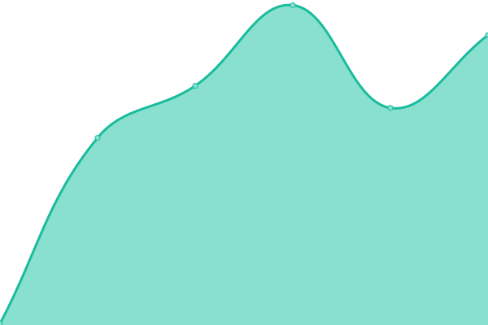

# [📈 Live Status](https://kuxav.github.io/stats01): <!--live status--> **🟩 Semua sistem operasional**

This repository contains the open-source uptime monitor and status page for [Kusanalika Xamarin Vohagen](kuxav.1423.my.id), powered by [Upptime](https://github.com/upptime/upptime).

With [Upptime](https://upptime.js.org), you can get your own unlimited and free uptime monitor and status page, powered entirely by a GitHub repository. We use [Issues](https://github.com/kuxav/stats01/issues) as incident reports, [Actions](https://github.com/kuxav/stats01/actions) as uptime monitors, and [Pages](https://kuxav.github.io/stats01) for the status page.

<!--start: status pages-->
<!-- This summary is generated by Upptime (https://github.com/upptime/upptime) -->
<!-- Do not edit this manually, your changes will be overwritten -->
<!-- prettier-ignore -->
| URL | Status | History | Response Time | Waktu aktif (semua) |
| --- | ------ | ------- | ------------- | ------ |
|  [start.1423](https://start.1423.my.id) | 🟩 Aktif | [start-1423.yml](https://github.com/kuxav/stats01/commits/HEAD/history/start-1423.yml) | 

 191miltdk
     
 | 

<a href="https://1.1423.my.id/history/start-1423">100.00%</a>
    

|  [with_pages.dev](https://1423.pages.dev) | 🟩 Aktif | [with-pages-dev.yml](https://github.com/kuxav/stats01/commits/HEAD/history/with-pages-dev.yml) | 

 128miltdk
     
 | 

<a href="https://1.1423.my.id/history/with-pages-dev">100.00%</a>
    

|  [Berkas](https://berkas.1423.my.id) | 🟩 Aktif | [berkas.yml](https://github.com/kuxav/stats01/commits/HEAD/history/berkas.yml) | 

 561miltdk
     
 | 

<a href="https://1.1423.my.id/history/berkas">89.49%</a>
    

|  [Qiqi x 1423](https://77.1423.my.id) | 🟩 Aktif | [qiqi-x-1423.yml](https://github.com/kuxav/stats01/commits/HEAD/history/qiqi-x-1423.yml) | 

 1736miltdk
     
 | 

<a href="https://1.1423.my.id/history/qiqi-x-1423">99.52%</a>
    

<!--end: status pages-->

[**Visit our status website →**](https://kuxav.github.io/stats01)

## 📄 License

- Powered by: [Upptime](https://github.com/upptime/upptime)
- Code: [MIT](./LICENSE) © [Kusanalika Xamarin Vohagen](kuxav.1423.my.id)
- Data in the `./history` directory: [Open Database License](https://opendatacommons.org/licenses/odbl/1-0/)
